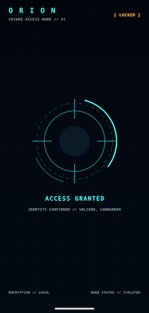
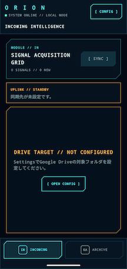

# ORION
このアプリは、技術情報・技術ブログメモを管理するための、近未来サイバーコンソールをテーマとした Android アプリです。
このアプリは私一人しか使わないため **実用性よりもワクワクを優先する** をコンセプトにします。
具体的にはUI・アニメーション・サウンド・世界観。「未来の司令システムを操作している」と感じられることを最優先に設計します。

## コンセプト

映画やゲームに登場するコンソール画面には、多くの場合、実用性を無視した派手な演出があります。
通常の業務アプリでは避けられるような、

* ホログラムのようなUI
* サイバーな演出
* 無駄に格好いいアニメーション
* ブートシーケンス
* ターミナル風の画面遷移
* 発光するパネル
* リアルタイムログ表示

を積極的に取り入れ、「触っていて楽しい」アプリを目指します。

---

# 機能
## Secure Access

ORIONはアプリ起動時にロックし、生体認証または端末のPIN・パターン・パスワードで認証できた場合だけ操作できます。同じ起動セッション内では、バックグラウンドから復帰しても再認証を求めません。
認証前後には「近未来のAI研究施設」のセキュアブートを表現する短いHUDアニメーションを表示します。
認証がキャンセルされた場合や一時的に利用できない場合は、通常画面を公開せず再試行できる状態を保ちます。

---

## Incoming Intelligence 
- 今週収集した技術情報を管理します。
- Google Drive上のGoogleドキュメントまたはWord文書（`.docx`）のタイトル
- Google Drive上の最終更新日時
- 設定したフォルダからの相対パス

Google Driveの指定したフォルダを設定画面で選択し、画面上の手動更新を実行したときだけ、GoogleドキュメントとWord文書（`.docx`）のタイトル、最終更新日時、相対パスを取得します。アプリ起動時やバックグラウンドでは自動取得しません。
取得結果は端末内へ保存し、オフラインや取得失敗時も最後に取得できた一覧を表示します。
一覧のタイトルをタップすると、対象文書を対応アプリまたはブラウザで開きます。ORION内では文書本文を取得・保存・表示しません。オフライン閲覧は外部ビューアの機能を利用します。

資料にはお気に入りと概要メモを端末内だけに保存できます。一覧をお気に入りで絞り込み、カード下部のメモ欄から専用画面で複数行のメモを編集・保存します。お気に入りはカード右上の照準で捕捉・解除し、ブラケットの収束と発光で操作結果を表現します。メモは`FIELD NOTE`の2行窓に表示し、2行を超える場合は上方向へ連続スクロールして全文を循環させます。画面外やバックグラウンドでは停止し、システムのアニメーション無効時は先頭2行を静止表示します。Driveと同期してもお気に入りとメモを保持します。同期対象から消えた資料も個人情報があれば「同期対象外」として残し、確認後にローカル記録だけを削除できます。

Google Drive連携を利用するには、ローカル実行であってもGoogle Cloudプロジェクトの作成、Google Drive APIの有効化、OAuth同意画面とAndroid OAuthクライアントの設定が必要です。Firebaseへのアプリ登録や`google-services.json`は使用しません。ORIONは本文を取得せず、`drive.metadata.readonly`スコープでDrive全体のメタデータを参照し、選択フォルダ配下を走査します。

開発環境からGoogle Driveへ接続するための設定は [`docs/GoogleDriveSetup.md`](docs/GoogleDriveSetup.md) を参照してください。

---

## Knowledge Archive

最近読んだ記事や書籍の記録です。保存する内容は以下の通りです。

* 記事タイトル
* URL
* メモ

---

# Design Principles

* Jetpack Compose First
* Material Designに縛られない
* 60FPSを維持する
* 過剰なアニメーションでも滑らかに動くこと
* ローカルファースト

---

# UI Theme

世界観は「近未来のAI研究施設」です。キーワードは以下の通りです。

* Cyberpunk
* Sci-Fi
* Tactical UI
* Hologram
* HUD
* Terminal
* Intelligence
* Mission Control

---

# Tech Stack

* Kotlin
* Jetpack Compose
* Room
* Navigation Compose
* Coroutines
* Flow
* Dagger Hilt
* Material 3（必要最低限）
* Canvas
* Animation
* Custom Drawing

---

# Screen Shot
　
